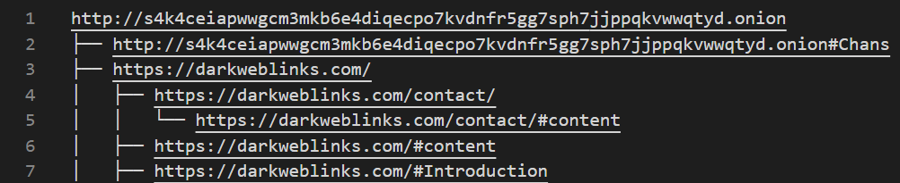

## Introduction

<!-- The SpyDark developed as a full stack application had some limitations. The user who has the application has to go through a lot of overhead to install the application properly. Even if the user properly installs the application, the information that the user can get from this application is limited. It happened because the web application can send a limited amount of data from frontend to backend. If the user ever puts the request to crawl a huge amount of data, the application might not work properly. 
To overcome all this, the team decided to develop a tool that will be open source. There will be a certain number of steps that the user has to go through to set up the crawler and the user is good to go. This way, anyone can use the features developed by the team to get a lot of information from the dark web. -->


## How to Install and Run the tool
### Tor Setup 
        

1) First of all install tor browser in your computer 
2) Open the terminal and then go to the location where tor.exe file is present (It might be under main Tor folder/Browser/TorBrowser)
3) Run this command in terminal and put your password there ``` tor ---hash-password <your_password> | more ```
4) Then it will generate hash password , copy that password 
5) Then Go to the location Tor_Browser\Browser\TorBrowser\Data\Tor and open torrc file
6) write this in torrc file (hashpassword is the one you copied earlier)
```
   ControlPort 9051 
   HashedControlPassword <hash_password>
```


### Tool Setup
1) Clone this repository using and open the tool in code editor
```
$ git clone https://github.com/pranav750/SpyDark](https://github.com/pranav750/tool.git
```
2) Get in the tool directory and install the dependencies:
```
$ pip install -r requirements.txt
```
3) Create a .env file in the parent directory and put variable values as guided in .env.sample file

### How to use Tool

Commands
<ul>
   <li>dark :  crawling the dark web</li>
   <li>surface : crawling the surface web</li>
   <li>url : url that is used to crawl</li>
   <li>keyword : keyword used for crawling </li>
   <li>multi : multithreaded algorithm used for crawling</li>
   <li>BFS : breadth first search used for crawling</li>
   <li>DFS : depth first search used for crawling</li>
   <li>depth : number of depth used for crawling</li>
 </ul>
  
command for crawling:
<br>
<br>
 <strong>python spydark.py --<dark/surface> --<url/keyword> <specify your url/keyword> --<multi/bfs/dfs> --depth <specify your depth>  </strong>   
        <p> Multithreaded crawling example:</p>
```
   python spydark.py --dark --url <any onion link>  --multi --depth <depth>    
```
        
<p> Crawling with BFS example:</p>
        
```
   python spydark.py --dark --url <any onion link>  --bfs --depth 2     
```
        
<p> Crawling with DFS example:</p>
        
```
   python spydark.py --dark --url <any onion link>  --dfs --depth 2     
```
        
<p>Surface crawling example:</p>
        
```
   python spydark.py --surface --url <any onion link> --depth 2     
```

        
        
 ## Features
<ul>
<li><strong>Crawling</strong> - The Spydark gives us an option to crawl both: a URL as well as a Keyword. Users just need to enter the URL or Keyword followed by the depth for crawling. If users don’t specify the depth Spydark will crawl using the default depth which is 1. After the crawling process is completed by Spydark on the surface/deep web, the page content on the links are combined together and are parsed to get the five most occurring words. The crawling that is performed here is the iterative crawling. From here, the user will get the links as results and the user can click on any result and the Spydark will take the user to a page where all the details of the link will be present.</li>
        <br>
<li><strong>Multi-threaded Crawling</strong> - Multi-threading is defined as the ability of a processor to execute multiple threads concurrently. Running several threads is similar to running several different programs concurrently, but with the following benefits −
Multiple threads within a process share the same data space with the main thread and can therefore share information or communicate with each other more easily than if they were separate processes.
Threads are sometimes called light-weight processes and they do not require much memory overhead; they are cheaper than processes.</li>
       <br>
<li><strong>Word Cloud</strong> - Word cloud is a data visualisation technique used for representing text data in which the size of each word indicates its frequency or importance. Significant textual data points can be highlighted using a word cloud. Word clouds are widely used for analysing data from social network websites.</li>
        <br>
<li><strong>Link Tree:</strong> After the crawling process is done Link Tree file will generate the link tree with the hierarchical structure of links</li>
        
 <br>
 <br>
        
<li><strong>Saving Crawled Info</strong> : After crawling the dark web whatever the data is gathered from the url that will be stored into JSON/CSV file. <br>
  The json file will contain following details for each link  <br> 
 </li>
     
</ul>
   
```
  {
     base_url,
     active_links,
     inactive_links,
     top_five_keywords,
     time_taken,
     crawled_links : [{
                title,
                link_status,
                link,
                parent_link,
                text,
                html
        }]
  }
```
    
## Python Dependencies
<ul>
        <li> python </li>
        <li>PySocks</li>
        <li>beautifulsoup4 </li>
        <li>urllib3 </li>
        <li>bs4 </li>
        <li>requests </li>
        <li>python-dotenv </li>
        <li>threaded </li>
        <li>wordcloud </li>
        <li>anytree</li>
        <li>lxml</li>
        </ul>
        
        
